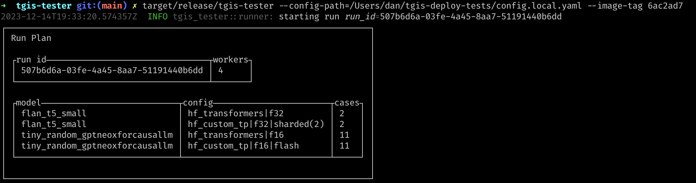
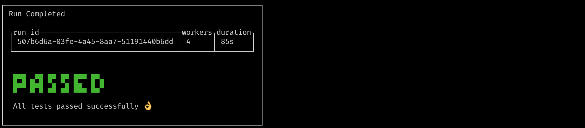
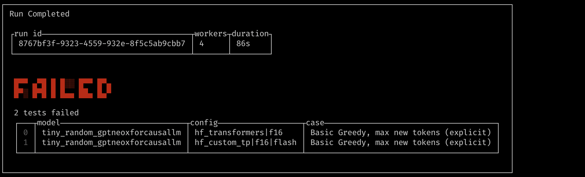
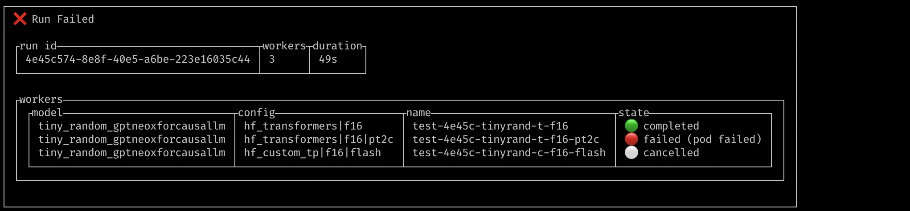
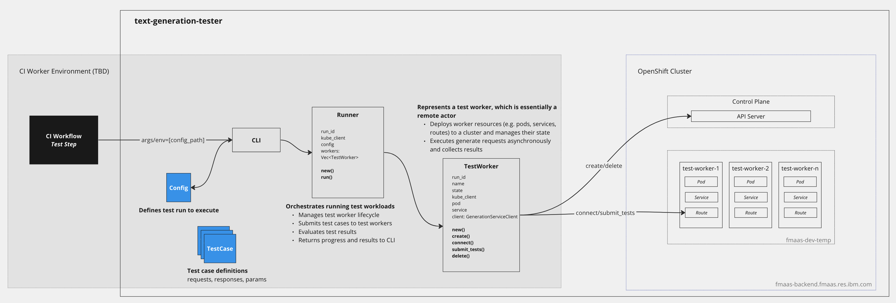

# tgis-tester

tgis-tester is a framework for remote testing of TGIS with various model configurations.

## Table of contents

- [How it works](#how-it-works)
- [Configuration](#configuration)
- [Adding new tests](#adding-new-tests)
- [Triggering runs](#triggering-runs)
- [Evaluation](#evaluation)
- [Architecture](#architecture)
- [Roadmap](#roadmap)

## How it works

tgis-tester is a lightweight binary that runs in a resource-constrained environment, such as a CI pipeline or development environment. It creates and manages test workers in a remote GPU-enabled Kubernetes/OpenShift cluster, where the heavy lifting (text generation inference) is performed. At a high-level, tgis-tester performs the following steps: validates configuration, builds a work plan, creates remote workers, submits tests to workers, collects results, terminates workers, and finally, performs evaluation and displays results in the CLI.

### Screenshots

Run Plan:


Run Completed - Tests Passed:


Run Completed - Tests Failed:


Run Failed:


## Configuration
tgis-tester is fully configurable using a single config file, [config.yaml](config.yaml), which includes configuration for the cluster, worker, runner, and tests. You will most often be concerned with the `tests` section, which contains a list of test specs to run.

### Test Spec

A test spec [[`TestSpec`](tgis-tester/src/config.rs#L98)] defines a model, a set of model configs, and a set of test case files to evaluate. For each config, a worker is created to perform inference on the set of test cases using that config. This enables us to ensure that test cases pass using various model configs.

### Model Config

A model config [[`ModelConfig`](tgis-tester/src/config.rs#L133)] consists of all TGIS model parameters (deployment_framework, max_batch_size, num_shard, flash_attention, etc) and resource configuration (cpu, memory, gpu). Defaults are set for all options except `deployment_framework`, which must be provided. At a minimum, you should set `deployment_framework` and `dtype_str`.

The example below will create 3 workers for `flan-t5-small` (standard, pt2_compile, and sharded), which will each run test cases in [flan-t5-small.yaml](tests/flan-t5-small.yaml). Some test cases are skipped for certain configs, so each worker may run a different number of tests.
```yaml
- model: google/flan-t5-small
  configs:
    - deployment_framework: hf_transformers
      dtype_str: float32
    - deployment_framework: hf_transformers
      dtype_str: float32
      pt2_compile: true
    - deployment_framework: hf_custom_tp
      dtype_str: float32
      num_shard: 2
      resources:
        gpu: 2
  cases:
    - /app/tests/flan-t5-small.yaml
```

### Resources

By default, worker pods are configured with the following requests and limits:
```yaml
requests:
  cpu: 4
  memory: 32G
  nvidia.com/gpu: 1
limits:
  cpu: 8
  memory: 128G
  nvidia.com/gpu: 1
```
You can override these defaults by setting `resources` in a model config. 

To override CPU/memory requests or limits:
```yaml
resources:
  request_cpu: 32
  request_memory_gb: 64
  #limit_cpu:
  #limit_memory_gb:
```

To override GPU, e.g. for sharded, if you set `num_shard: 2`, you'll also need to set `gpu: 2`
```yaml
- deployment_framework: hf_custom_tp
  dtype_str: float16
  flash_attention: true
  num_shard: 2
  resources:
    gpu: 2
```

For CPU-only, set `gpu: null` explicitly, so that `CUDA_VISIBLE_DEVICES` will be set to `-1`.

For MIG *(not yet supported on cluster)*, options are `mig_1g_10gb`, `mig_2g_20gb`, and `mig_3g_40gb`, e.g.
```yaml
resources:
  gpu:
    mig_1g_10gb: 1
```

## Adding new tests
1. Create a new branch
2. Add test case file `<model_name>.yaml` to `/tests`
3. Add test spec for model to [config.yaml](config.yaml), including at least one config to run, e.g.
    ```yaml
    tests:
      - model: <model_name>
        configs:
          - deployment_framework: hf_transformers
            dtype_str: float32
        cases:
          - /app/tests/<model_name>.yaml
    ```
4. Open a PR to have someone peer review it

## Triggering runs

### CI Pipeline

TBD

### Local

You may also run tgis-tester on your local machine. This is especially useful for executing "test" runs of new tests to ensure that they work correctly. It is recommended to create a `config.local.yaml` file for this purpose, which is gitignored.

Requirements:
- Rust is [installed](https://www.rust-lang.org/tools/install)
- You must be connected to a VPN with connectivity to the cluster API server
- You must set `TESTER_SERVICE_ACCOUNT_TOKEN=<token>` environment variable or add `service_account_token: <token>` to your `cluster` config
  - Extract this token from the `text-generation-tester-token-cvzcq` secret

Steps:
1. Copy the `proto` directory from the [text-generation-inference](https://github.com/IBM/text-generation-inference) repo into `tgis-deploy-tests`
   - TODO: update build.rs and Dockerfile to avoid this
   ```
   cd tgis-deploy-tests
   cp -r ../text-generation-inference/proto .
   ```
2. Build
    ```
    cd tgis-tester
    cargo build --release
    ```
3. Run
    ```
    target/release/tgis-tester --config-path=/Users/<user>/tgis-deploy-tests/config.local.yaml --image-tag <image_tag>
    ```
    image_tag is the tag of `text-gen-server` to run on the remote workers

## Evaluation
TODO

## Architecture

